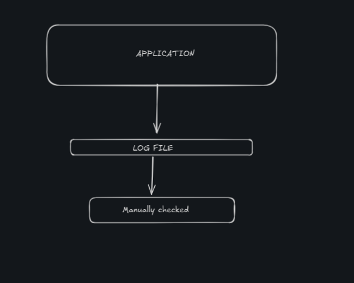
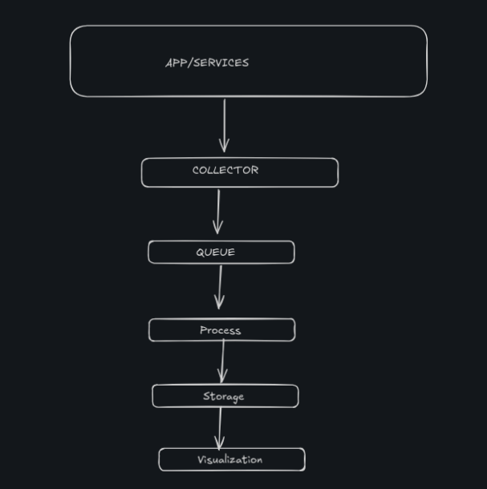

# High-Throughput-Log-Aggregator

### Wha is meant by High Throughput

High throughput means the system can handle a large number of log events per second continuously, not just in a short burst.

### USE CASE
During peak traffic, multiple microservices generate thousands of log events every second. The High Throughput Log Aggregator ingests, buffers, processes, and stores these logs in real time, enabling engineers to quickly search logs, detect failures, and troubleshoot issues without losing data.

### What is the that my laptop can handle

### What are the possible choking points
## 1. Log producer
The app itself may generate logs too slowly or too fast.
Bad logging code can block the request path. That is fatal in high-throughput systems.

## 2. Collector / agent
This is where logs are picked up, parsed, batched, compressed, or forwarded.
If the collector is synchronous or too CPU-heavy, it becomes the bottleneck.

## 3. Network
Even locally, container-to-container traffic can choke if you send too many tiny messages instead of batching.

## 4. Queue / stream
If the queue cannot absorb bursts, logs pile up at the producer.
If the queue is too small, you lose the whole point of buffering.

## 5. Processor
Parsing JSON, adding metadata, filtering noise, and enriching records all cost CPU.
Bad regexes and huge payloads will hurt badly.

## 6. Storage
Writing every log one by one to disk or a database will collapse quickly.
You need batching, indexing discipline, and retention rules.

## 7. Query layer / dashboard
Even if ingestion is fine, Grafana or your query API can become slow when the stored dataset grows.

### End to End measuring
### Ingest metrics
<li>events/sec accepted

<li>bytes/sec accepted

<li>dropped events

<li>retry count

<li>Latency metrics

<li>producer timestamp → collector receive time

<li>collector receive time → queue publish time

<li>queue publish time → processor start time

<li>processor start time → storage write time

<li>storage write time → query availability time

#### Quality metrics

<li>loss rate

<li>duplicate rate

<li>ordering errors

<li>malformed log rate

#### System metrics

<li>CPU usage

<li>RAM usage

<li>disk I/O

<li>network I/O

<li>queue depth / lag

<li>container restarts

## What is this project for

 collect logs from one or more apps, move them through a scalable pipeline,buffer bursts,process them asynchronously,store them reliably,and visualize/search them later.

## USER STORY
1. Developers
They use it to find errors, trace requests, and debug bugs in services.

2. DevOps / SRE engineers
They use it to watch system health, detect failures, inspect spikes, and respond during incidents.

3. QA / Test engineers
They use it to verify behavior during testing and catch failures in test environments.

4. System administrators / platform admins
They use it to monitor infrastructure and check whether services are behaving normally.

5. Security / audit teams
They use it to inspect suspicious activity, access patterns, and event history.

## TRADITIONAL SOLUTION

## PROBLEMS WITH TRADITIONAL SOLUTION
<li>Logs are scattered across different servers.

<li>Engineers must SSH into each server to inspect logs.

<li>Searching logs across multiple machines is slow and tedious.

<li>During high traffic, disks fill up or the application slows down because it's writing logs synchronously.

<li>No central place to search, filter, or visualize logs.

<li>Difficult to correlate events across multiple microservices.

## PROPOSED SOLUTION

## Challenges in Designing a High-Throughput loggers for Logging

<li><b>High Volume of Concurrent Requests:</b> The system needs to efficiently handle millions of requests per second.

<li><b>Data Durability:</b> Events should never be lost, even in the event of system failures.

<li><b>Scalability:</b> As traffic spikes, the system must scale seamlessly without manual intervention.

<li><b>Performance:</b> The system should maintain low-latency for API responses and analytics queries.

<li><b>Resilience:</b> The system must be resilient to partial failures (e.g., database issues or network timeouts).

## HIGH LEVEL ARCHITECTURE

## Technical Requirements & Specifications

This system is built around a decoupled, micro-batched architecture designed to minimize CPU overhead at the log producers and maximize write throughput at the storage layer. Below are the structural requirements and component specifications.

### 1. Architecture Infrastructure Components
* **Log Collection (Edge):** Vector / Fluent Bit (Sidecar/Daemon deployment)
* **Message Buffer (Queue):** Apache Kafka / Redpanda 
* **Data Processing Layer:** Custom Go Channels / Rust Tokio Workers
* **Search & Indexing Engine:** OpenSearch / Elasticsearch
* **Time-Series Columnar Analytics:** ClickHouse
* **Visualization Layer:** Grafana

---

### 2. Component Resource Allocation Baselines

| Component | CPU Profile | Memory (RAM) Target | Storage I/O Profile |
| :--- | :--- | :--- | :--- |
| **Log Collectors** | 0.1 – 0.5 vCPU | 50MB – 100MB | Minimal (Non-blocking disk buffer fallback) |
| **Message Buffer** | 4 – 8 vCPUs | 16GB – 32GB | High Sequential Writes (OS Page Cache optimized) |
| **Processing Workers**| 2 – 4 vCPUs | 1GB – 2GB | Stateless (Ephemeral network throughput) |
| **Search Engine** | Heavy Multi-core | 32GB (16GB JVM Heap) | Ultra-High Random I/O (NVMe Recommended) |
| **Analytics Database**| Compute-optimized| 16GB – 32GB | Heavy Columnar Compression (Standard SSD) |

---

### 3. Protocols, Runtimes, and OS Optimizations

#### Kernel & Networking
* **Zero-Copy Mechanism:** Requires Linux Kernel support for `sendfile()` system calls to streamline data transfer between network sockets and disk pages without user-space context switching.
* **Transport Protocols:** Ingestion utilizes the native Kafka binary protocol over TCP; downstream persistence utilizes gRPC or the HTTP Bulk API.
* **Compression Pipelines:** In-transit serialization enforced using high-speed **LZ4** or **Zstd** compression algorithms directly from the edge agent forward.

#### Pipeline Performance Tuning
* **Edge Ingestion Thresholds:** Micro-batching configured to flush payloads at either **1,000 discrete events** OR a **250ms** sliding timeout window.
* **Database Bulk Injection:** Processing workers aggregate transformed, structured records into arrays of **5,000 to 10,000 lines** per singular database transaction.
* **Concurrency Alignment:** The log-ingest Kafka topic partition count must equal or scale beyond the collective core capacity of active consumer workers to ensure horizontal scaling.

---

### 4. Local Development Environment Spec
For rapid prototyping, isolated feature testing, and orchestration validation using Docker Compose, the local host machine must meet or exceed the following hardware baseline:

* **Operating System:** Native Linux Environment (e.g., Ubuntu 24.04 LTS) for precise container network isolation and file descriptor allocation.
* **Processor Architecture:** 4 to 6 Physical CPU Cores.
* **System Memory:** 16GB RAM Minimum (Recommended allocation allocation: 2GB Kafka, 4GB OpenSearch, 2GB ClickHouse, remaining headroom reserved for local runtimes and Docker daemon execution).
* **Disk Space:** Minimum 20GB free space partitioned on a solid-state drive (SSD).
# High Throughput Log Aggregator
